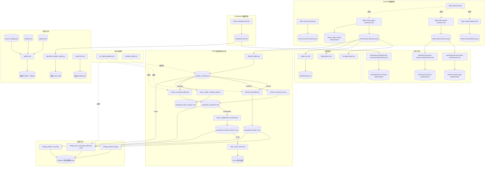

# scripts/ — 脚本说明

> 本目录包含数据抓取、表格提取、报告生成等核心脚本（29 个）。  
> 一次性探测/修补脚本已在 `46c121c` 中清理。

---

## 依赖关系图

---

## 脚本清单

### 一、月度更新与手动导入

| 脚本 | 功能 | 输入 | 输出 | 调用方式 |
|------|------|------|------|----------|
| **update.mjs** | 核心编排：按 source-catalog 爬取源站，合并到 bundle，生成月度/周度简报 | `source-catalog.json`, `bundle.json`, `reports.json`, `crawl-index.json`；可选 LLM API | 更新 `bundle.json`, `reports.json`, `crawl-index.json` | `npm run update:monthly [-- --month=YYYY-MM]` `npm run update:weekly` |
| **import-url.mjs** | 手动导入单条 URL（抽取标题和 meta），追加到 bundle | 命令行参数 `<URL> <category>` | 更新 `bundle.json` | `npm run import:url <URL> policy\|news\|paper` |

### 二、CELMA 数据抓取（6 个）

| 脚本 | 功能 | 输入 | 输出 | 调用方式 |
|------|------|------|------|----------|
| **fetch-celma-annual.mjs** | 抓取 CELMA 全国年度发行额（一般/专项） | CELMA API (指标 0301) | `celma-annual-issuance.json` | `npm run fetch:celma` |
| **fetch-celma-balance.mjs** | 抓取 CELMA 全国年度债务余额 | CELMA API (指标 06) | `celma-annual-balance.json` | `node scripts/fetch-celma-balance.mjs` |
| **fetch-celma-bond-issuance.mjs** | 爬取 CELMA 债券栏目（发行安排/发行前公告/发行结果）列表与详情 | CELMA 网站 (channels 192-194) | `celma-bond-issuance.json` | `node scripts/fetch-celma-bond-issuance.mjs` |
| **fetch-celma-policy-dynamics.mjs** | 爬取"债券市场动态"栏目（政策动态/重大事项），含附件下载和智能标签 | CELMA 网站多栏目 | `celma-policy-dynamics.json`, `celma-major-events-attachments/` | `npm run fetch:celma-policy` |
| **fetch-celma-all.mjs** | 一次性调用上述多个 fetch 脚本 | — | 更新所有 `celma-*.json` | `node scripts/fetch-celma-all.mjs` |
| **fetch-chinabond-list.mjs** | 从 Chinabond 抓取地方债综合查询列表与详情 | Chinabond API | `chinabond-list.json` | `node scripts/fetch-chinabond-list.mjs [--all\|--since=YYYY-MM-DD]` |

### 三、附件下载（3 个）

| 脚本 | 功能 | 输入 | 输出 | 调用方式 |
|------|------|------|------|----------|
| **download-issuance-plan-attachments.mjs** | 下载 CELMA"发行安排"页面的 PDF 附件 | `celma-bond-issuance.json` | `celma-issuance-plan-attachments/` | `node scripts/download-issuance-plan-attachments.mjs` |
| **download-bond-pre-issuance-attachments.mjs** | 下载 CELMA"发行前公告"页面的附件 | `celma-bond-issuance.json` | `celma-pre-issuance-attachments/` | `node scripts/download-bond-pre-issuance-attachments.mjs` |
| **download-chinabond-pre-issuance-attachments.mjs** | 下载 Chinabond 发行前披露附件 | `chinabond-list.json` | `chinabond-pre-issuance-attachments/` | `node scripts/download-chinabond-pre-issuance-attachments.mjs` |

### 四、PDF 表格提取流水线（8 个）

典型执行顺序：`classify → extract_textual → extract_scanned → vision_supplement → merge`

| 脚本 | 功能 | 输入 | 输出 | 调用方式 |
|------|------|------|------|----------|
| **classify_tables.py** | 分类附件为 textual/scanned/excel/other | `celma-policy-dynamics.json` + 附件目录 | `classify_results.json` | `python scripts/classify_tables.py` |
| **extract_pdf_tables.py** | pdfplumber 提取文本型 PDF 表格 | classify_results → textual PDF 列表 | `extracted_textual/*.xlsx` | `python scripts/extract_pdf_tables.py [--force] [--limit N]` |
| **extract_scanned_ocr.py** | Tesseract OCR 提取扫描型 PDF（基线） | classify_results → scanned PDF 列表 | `extracted_scanned/*.xlsx` + quality 评分 | `python scripts/extract_scanned_ocr.py [--force] [--limit N]` |
| **extract_scanned_tables.py** | OCR + Vision 组合提取扫描型 PDF | classify_results → scanned PDF 列表 | `extracted_scanned/*.xlsx` | `python scripts/extract_scanned_tables.py [--vision-only]` |
| **vision_supplement_scanned.py** | 对 OCR 质量差的页面调用 Vision 兜底 | `extracted_scanned/*.xlsx` + quality flag | `extracted_scanned_vision/*.xlsx` | `python scripts/vision_supplement_scanned.py [--only-poor]` |
| **retry_vision_errors.py** | 重试 Vision 提取失败的页面 | `extracted_scanned_vision/*.xlsx` 中的 error sheets | 更新同目录 xlsx | `python scripts/retry_vision_errors.py [--limit N]` |
| **vision_repair_merged_cells.py** | 对低质量文件用增强 prompt 的 Vision 重新提取 | classify_results + extracted xlsx + 原始文件 | `extracted_vision_repair/*.xlsx` | `python scripts/vision_repair_merged_cells.py [--phase textual\|scanned]` |
| **sample_tables.py** | 抽样显示表格前 5 行（调试用） | classify_results → 表格文件 | 控制台输出 | `python scripts/sample_tables.py` |

### 五、表格合并（4 个）

| 脚本 | 功能 | 输入 | 输出 | 调用方式 |
|------|------|------|------|----------|
| **merge_phase1_excel.py** | 从原始 Excel 附件合并为标准 31 列格式 | classify_results → excel 列表 | `merged_用途调整表.xlsx` | `python scripts/merge_phase1_excel.py` |
| **merge_phase2_pdf.py** | 将文本型 PDF 提取结果追加到合并表 | `merged_用途调整表.xlsx` + `extracted_textual/` | 更新 `merged_用途调整表.xlsx` | `python scripts/merge_phase2_pdf.py` |
| **merge_from_extracted_tables_v1.py** | 一次性位置对齐合并（旧版） | `extracted_textual/` + classify_results | `merged_用途调整表_v1.xlsx` | `python scripts/merge_from_extracted_tables_v1.py` |
| **merge_from_extracted_tables.py** (v2) | 语义列对齐合并（改进版，支持 Vision 结果） | `extracted_textual/` + `extracted_scanned/` + `extracted_scanned_vision/` | `merged_用途调整表.xlsx` | `python scripts/merge_from_extracted_tables.py [--include-scanned] [--include-vision]` |

### 六、标签修复与工具（3 个）

| 脚本 | 功能 | 输入 | 输出 | 调用方式 |
|------|------|------|------|----------|
| **fix-region-tags.mjs** | 修复 policy-dynamics 中错误的省份标签 | `celma-policy-dynamics.json` | 更新同文件 | `node scripts/fix-region-tags.mjs` |
| **retag-topics.mjs** | 重新分类"重大事项"条目主题 | `celma-policy-dynamics.json` | 更新同文件 | `node scripts/retag-topics.mjs` |
| **regen-csv.mjs** | 从 JSON 重建 download-log.csv | `celma-policy-dynamics.json` | `download-log.csv` | `node scripts/regen-csv.mjs` |

### 七、流水线编排（1 个）

| 脚本 | 功能 | 输入 | 输出 | 调用方式 |
|------|------|------|------|----------|
| **run_table_pipeline.ps1** | 按顺序执行 extract → merge 全流程 | — | `merged_用途调整表.xlsx` | `powershell scripts/run_table_pipeline.ps1 [-IncludeScanned] [-Force]` |

### 八、周报生成（1 个）

| 脚本 | 功能 | 输入 | 输出 | 调用方式 |
|------|------|------|------|----------|
| **generate_weekly_report.py** | 根据 chinabond 数据生成周报 Word/PDF | `chinabond-list.json` | `docs/债券发行周报.docx/.pdf` | `python scripts/generate_weekly_report.py` |

---

## 环境变量

| 变量 | 用途 | 默认值 |
|------|------|--------|
| `LLM_API_KEY` / `LLM_BASE_URL` / `LLM_MODEL` | update.mjs 月度简报 LLM 增强 | 无（使用规则摘要） |
| `ANTHROPIC_API_KEY` / `ANTHROPIC_BASE_URL` / `ANTHROPIC_MODEL` | Vision 表格提取 | — |
| `FETCH_TIMEOUT_MS` | 外部 URL 抓取超时 | 15000 |
| `PORT` | 本地 API 端口 | 4010 |
